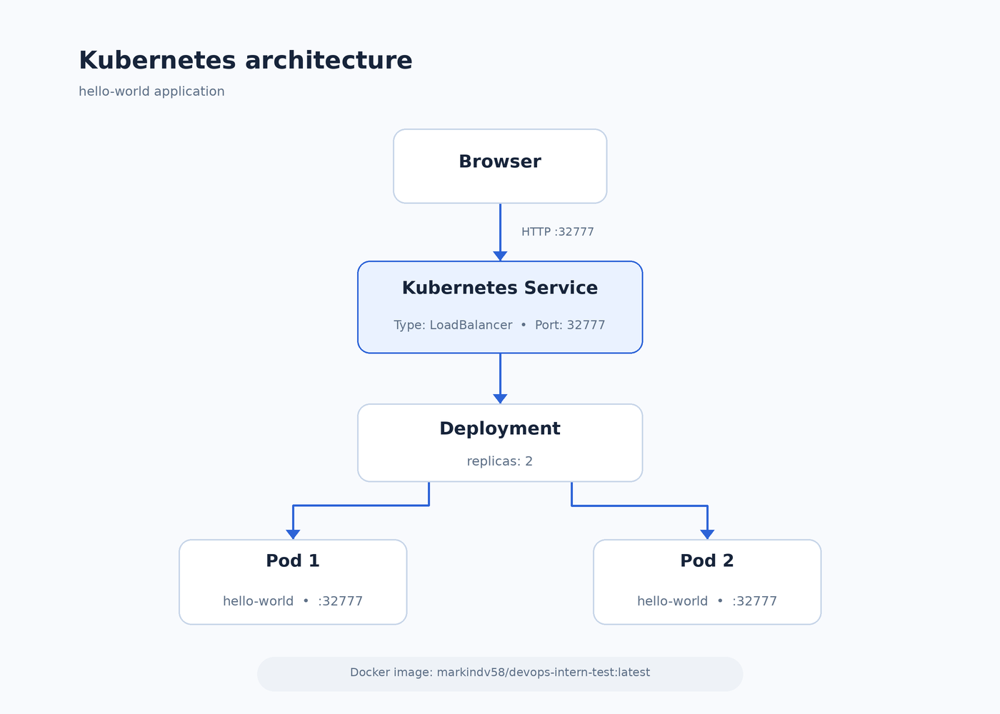

# DevOps Internship Test

Тестовое задание для стажировки.

## Что реализовано

- простое HTTP-приложение на Python;
- приложение работает на порту `32777`;
- Docker-образ собран и опубликован в Docker Hub;
- Minikube-кластер;
- Kubernetes Deployment с 2 репликами;
- Kubernetes Service типа LoadBalancer;
- доступ к приложению через `minikube tunnel`.

## Docker image

```text
markindv58/devops-intern-test:latest

## Kubernetes

Манифесты Kubernetes находятся в директории:

```text
kubernetes/
```

## Архитектура



Исходник схемы:

```text
docs/architecture.drawio
